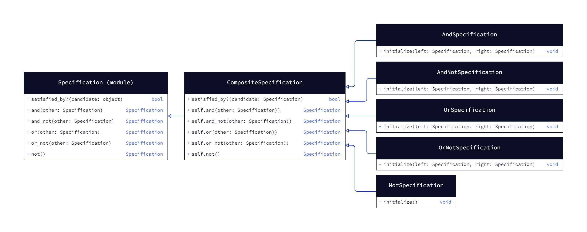

# Alloverit::Patterns::Specification

The Specification pattern is a design pattern used to encapsulate business logic and validation rules into reusable
and composable components. It allows you to separate the logic for decision-making from the entities or classes that
use the decision-making logic. This pattern is particularly useful for building complex queries and validation rules
in a flexible and maintainable manner.



In this gem, the Specification pattern is implemented through the `Alloverit::Patterns::Specification` module.

`CompositeSpecification` serves as the base class from which all specifications derive. It provides the interface for
combining and evaluating specifications using logical operations such as `and`, `and_not`, `or`, `or_not` and `not`.

This gem supports flexible composition, allowing you to combine specifications through both class and instance-level
operations.

Refer to the [Usage](#usage) section below for details on how to use this gem in your application.


## Installation

Install the gem and add to the application's Gemfile by executing:

```bash
bundle add alloverit-patterns-specification
```

If bundler is not being used to manage dependencies, install the gem by executing:

```bash
gem install alloverit-patterns-specification
```


## Dependencies
None.


## Usage

TODO: Write usage instructions here

## Demo Applications

Two demo applications are included. They `require` the local code so there's no need to install the gem to run them.

### Demo 1

To run the demo, run `rake run_demo1`.

### Demo 2

To run the demo, run `rake run_demo2`.


## License

The gem is available as open source under the terms of the [MIT License](https://opensource.org/licenses/MIT).
